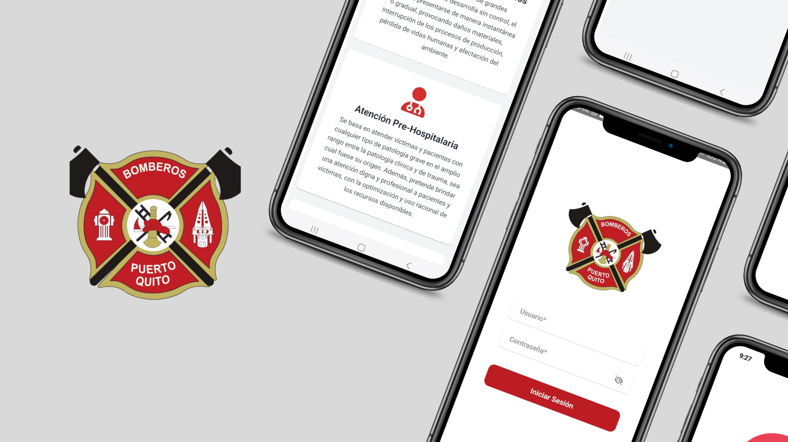

# **Introducción al aplicativo CBPQ para la gestión de fichas de inspección\***

Bienvenido al aplicativo CBPQ, una herramienta diseñada para facilitar la gestión, registro, y reporte de las inspecciones realizadas por el Cuerpo de Bomberos de Puerto Quito. Este sistema tiene como objetivo optimizar el control y seguimiento de las fichas de inspección mediante un entorno intuitivo y eficiente.

## Módulos del Sistema

### Principal

**Información de la Empresa.**
Esta vista permite a los usuarios visualizar la información general del Cuerpo de Bomberos de Puerto Quito, incluyendo su misión, visión, ubicación, y datos de contacto. Es una sección clave para familiarizarse con la institución y su propósito en la comunidad.

### Gestión de inspecciones

**Búsqueda de inspecciones.**
Este funcionalidad permite realizar búsquedas detalladas de inspecciones en el sistema utilizando filtros como fecha, ubicación, estado de la inspección, o el inspector asignado. Esta funcionalidad facilita localizar inspecciones específicas rápidamente.

**Registro de inspecciones.**
Permite registrar una nueva inspección de manera sencilla, ingresando datos como ubicación, observaciones, y otros detalles relevantes. Este módulo está diseñado para adaptarse al usuario logeado, garantizando un registro personalizado y seguro.

**Actualización de inspecciones.**
A partir de una inspección previamente buscada, el usuario puede actualizar los campos necesarios, como datos de contacto, observaciones o resultados de la inspección. Esto asegura que la información esté siempre actualizada.

**Eliminación de inspecciones.**
Este módulo ofrece la posibilidad de eliminar inspecciones específicas que ya no sean necesarias. La eliminación se realiza tras buscar la inspección correspondiente, garantizando que no se realicen eliminaciones accidentales.

**Imprimir inspecciones.**
Permite generar un archivo imprimible de la inspección seleccionada. Este reporte incluye todos los detalles relevantes y está diseñado para cumplir con los requisitos formales del Cuerpo de Bomberos de Puerto Quito.

**Compartir Inspecciones.**
Una vez generada e impresa una inspección, este módulo facilita compartirla directamente con los ciudadanos o entidades interesadas, ya sea mediante correo electrónico, mensajería u otros medios electrónicos.

### Reporte de fichas de inspección

Este módulo permite a los usuarios generar reportes detallados de las inspecciones realizadas en un rango de fechas específico. Los reportes pueden incluir gráficos, estadísticas y resúmenes, proporcionando una visión general del trabajo realizado y facilitando la toma de decisiones.
